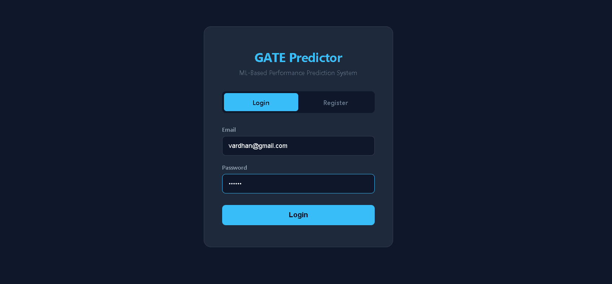
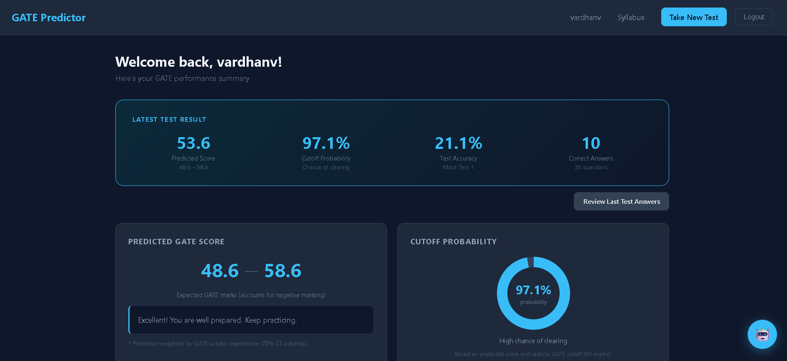
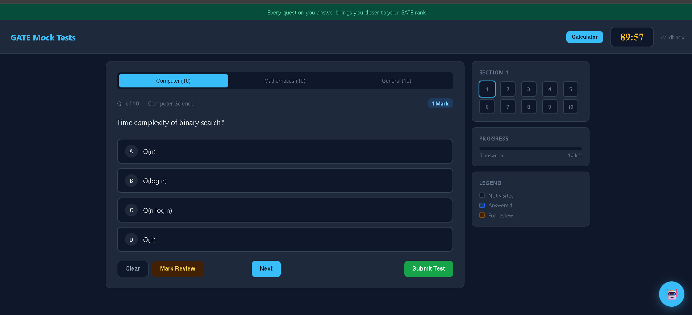
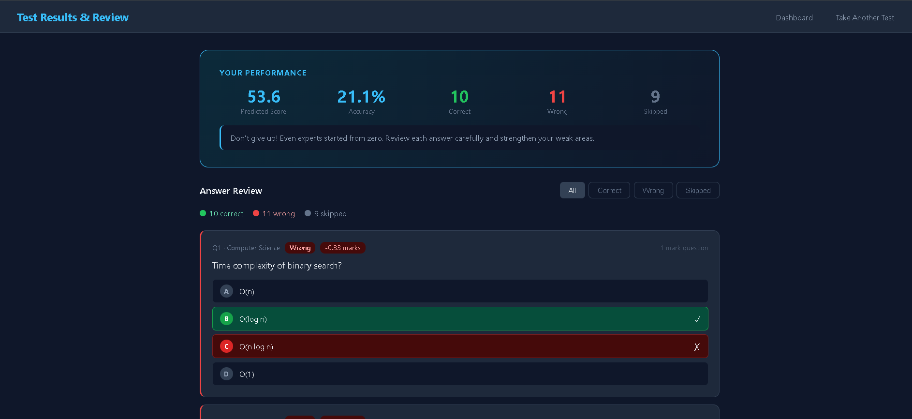
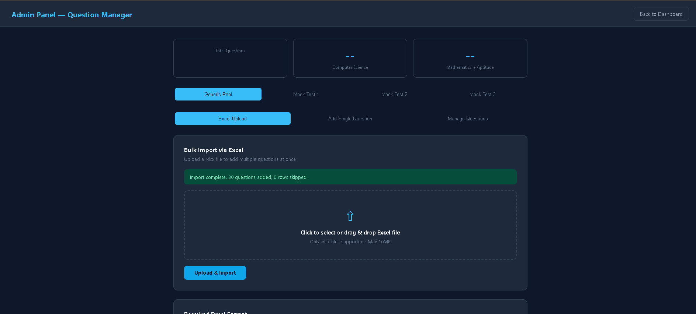

# 🎓 ML-Based GATE Performance Prediction System

An AI-powered full-stack web application that helps GATE aspirants evaluate their preparation through mock tests, machine learning-based score prediction, personalized study plans, and performance analytics.

## 🚀 Live Demo

🌐 Frontend: https://gate-prediction-system.vercel.app

---

# 📌 Features

- 🔐 JWT Authentication (Login & Registration)
- 📝 Full-length GATE Mock Tests
- 🎯 Standard GATE Negative Marking
- 📊 Performance Dashboard
- 🤖 Machine Learning Score Prediction
- 📈 Cutoff Probability Prediction
- 📚 Personalized AI Study Plan
- 💬 AI Chatbot (Gemini API)
- 📂 Admin Panel for Excel Question Upload
- 📱 Responsive UI

---

# 🛠 Tech Stack

## Frontend
- HTML5
- CSS3
- JavaScript

## Backend
- Spring Boot
- Spring Security
- Spring Data JPA
- JWT Authentication
- Maven

## Database
- MySQL

## Machine Learning
- Python
- FastAPI
- Scikit-learn
- Random Forest Regressor
- Logistic Regression
- Pandas
- NumPy
- Joblib

## Deployment
- Vercel (Frontend)
- Railway (Backend & MySQL)

---

# 🏗 Architecture

Frontend (HTML/CSS/JS)
        │
        ▼
Spring Boot REST API
        │
        ▼
MySQL Database
        │
        ▼
FastAPI ML Service
        │
        ▼
Random Forest + Logistic Regression

---

# 📂 Project Structure

```
ML-Based-GATE-Performance-Prediction_System
│
├── frontend/
│   ├── index.html
│   ├── dashboard.html
│   ├── test.html
│   ├── admin.html
│   └── assets/
│
├── backend/
│   ├── src/
│   ├── pom.xml
│   └── application.properties
│
├── ml-service/
│   ├── main.py
│   ├── train.py
│   ├── predict.py
│   └── requirements.txt
│
└── README.md
```

---

# ⚙ Prerequisites

Install the following software:

- Java 21
- Maven
- Python 3.10+
- MySQL 8+
- Git

---

# 📥 Clone the Repository

```bash
git clone https://github.com/vishnuvardhandumma/ml-gate-performance-prediction.git

cd ml-gate-performance-prediction
```

---

# 🗄 Database Setup

Create a MySQL database:

```sql
CREATE DATABASE gate_prediction;
```

Update:

```
backend/src/main/resources/application.properties
```

Example:

```properties
spring.datasource.url=jdbc:mysql://localhost:3306/gate_prediction

spring.datasource.username=root

spring.datasource.password=YOUR_PASSWORD
```

---

# ▶ Running the Backend

Move to backend folder

```bash
cd backend/backend
```

Run

```bash
mvn clean install

mvn spring-boot:run
```

Backend runs on

```
http://localhost:8080
```

---

# 🤖 Running the ML Service

Move to ML folder

```bash
cd ml-service
```

Install dependencies

```bash
pip install -r requirements.txt
```

Run FastAPI

```bash
uvicorn main:app --reload
```

ML Service

```
http://localhost:5000
```

---

# 🌐 Running the Frontend

Open

```
frontend/index.html
```

or use VS Code Live Server.

---

# 🔑 Default Workflow

1. Register
2. Login
3. Take Mock Test
4. Submit Test
5. View Dashboard
6. Check Predicted Score
7. Analyze Weak Subjects
8. Generate Study Plan

---

# 📊 Machine Learning

Models Used

- Random Forest Regressor
- Logistic Regression

Prediction Features

- Computer Science Accuracy
- Mathematics Accuracy
- General Aptitude Accuracy
- Time Taken
- Number of Attempts

Outputs

- Predicted GATE Score
- Score Range
- Cutoff Probability
- Weak Subjects
- Recommendations

---

# 📸 Screenshots

# 📸 Screenshots

## Login Page



---

## Dashboard



---

## Mock Test



---

## Results



---

## Admin Panel



---

# 🔮 Future Enhancements

- Adaptive Mock Tests
- Leaderboard
- Email Reports
- Mobile Application
- Previous Year Papers
- Interview Preparation Module

---

# 👨‍💻 Author

**Vishnu Vardhan Dumma**

GitHub

https://github.com/vishnuvardhandumma

LinkedIn

https://www.linkedin.com/in/vishnu-vardhan-dumma20/

---

# ⭐ If you found this project useful, please give it a Star.
