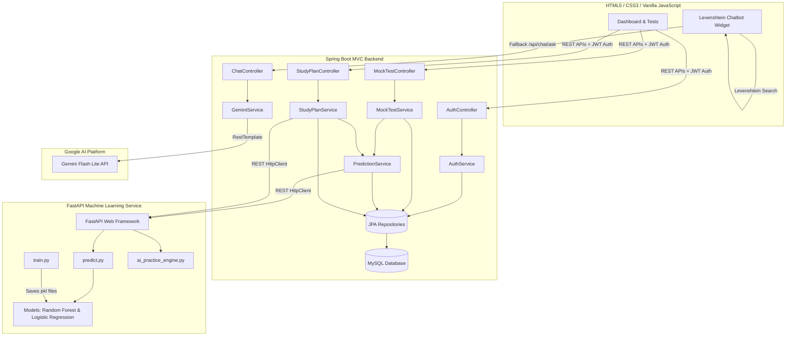

# GATE Performance Prediction System — Project Viva Preparation Guide

This comprehensive guide is designed for project viva preparation. It maps every theoretical concept directly to the actual code implementation found in this codebase.

---

## 🗺️ Project Architecture & Design

### High-Level Architecture (Mermaid)



---

## 🛠️ Project Execution Flow

The system coordinates between the frontend, the Spring Boot backend, the MySQL database, the FastAPI ML service, and the Gemini AI API:

```
[User Login/Registration] 
         │
         ▼
[Take 30-Question Mock Test] 
         │ (Submits Answers to Backend)
         ▼
[Calculate Marks & Apply GATE Negative Marking] 
         │
         ▼
[Calculate Subject Accuracies (EMA) & Topic Accuracies] 
         │
         ▼
[Save Mock Test & Answers to MySQL] 
         │
         ▼
[Call FastAPI ML Service (/predict)] 
         │ ──► [Scale Features with StandardScaler]
         │ ──► [Predict Score with Random Forest Regressor]
         │ ──► [Predict Cutoff clearance with Logistic Regression]
         │ ──► [Filter Weak Subjects (Acc < 60%) with Severity]
         ▼
[Return & Save Predictions to MySQL] 
         │
         ▼
[Generate Personalized AI Study Plan & Chatbot Interaction]
         │ ──► [StudyPlanService calculates weak topics & hours]
         │ ──► [FastAPI /study-plan formats schedule]
         │ ──► [Chatbot widget answers queries or calls Gemini API]
```

---

## 📚 Viva Q&A Guide (Comprehensive Project Analysis)

### 1. Motivation of the Project
*   **Conceptual Explanation**: Preparation for the GATE (Graduate Aptitude Test in Engineering) exam requires mastering a massive syllabus. Traditional practice tests only give a final score, leaving students in the dark about exact subject weaknesses, topic-level performance, and the statistical probability of clearing the competitive cutoff. The motivation is to provide an AI-driven, data-backed diagnostic tool that guides students through targeted study plans and real-time performance predictions to maximize their GATE score.
*   **Implementation**: Implemented via a diagnostic dashboard that displays dynamic score ranges, cutoff probabilities, categorized weak subjects, and detailed topic-level analytics based on mock test performance.
*   **File Path**: [dashboard.html](file:///c:/Users/vishn/Desktop/finalproject/gate-prediction-1/gate-prediction/frontend/dashboard.html)
*   **Function Name**: `loadLastResult()`
*   **Code Location**: [dashboard.html:L205-L270](file:///c:/Users/vishn/Desktop/finalproject/gate-prediction-1/gate-prediction/frontend/dashboard.html#L205-L270)
*   **Code Snippet**:
    ```javascript
    document.getElementById('predictionCards').style.display = 'grid';
    document.getElementById('scoreMin').textContent = pred.predictedScoreMin ? pred.predictedScoreMin.toFixed(1) : '--';
    document.getElementById('scoreMax').textContent = pred.predictedScoreMax ? pred.predictedScoreMax.toFixed(1) : '--';
    document.getElementById('recommendationText').textContent = pred.recommendation || '--';
    ```
*   **Line-by-Line Explanation**:
    *   `document.getElementById('predictionCards').style.display = 'grid';` makes the ML performance cards container visible.
    *   `document.getElementById('scoreMin').textContent = ...` writes the minimum predicted GATE score from the ML model response to the UI.
    *   `document.getElementById('scoreMax').textContent = ...` writes the maximum predicted score to the UI.
    *   `document.getElementById('recommendationText').textContent = ...` displays the personalized study advice based on the predicted cutoff probability.

---

### 2. Problem Definition
*   **Conceptual Explanation**: GATE candidates face three key problems:
    1.  **Varying Subject Weights**: Different subjects have different mark distributions (e.g., Computer Science is 70% of the paper, while Engineering Mathematics and General Aptitude are 15% each). A simple average score fails to represent GATE readiness.
    2.  **Negative Marking**: Multiple Choice Questions (MCQs) carry negative marks ($1/3$ for 1-mark questions, $2/3$ for 2-mark questions). Simple grading systems do not account for this penalty.
    3.  **Lack of Actionable Analytics**: Students do not know how their current mock test accuracy translates into actual GATE marks or their likelihood of passing the exam.
*   **Implementation**: Implemented in the backend test submission logic, which applies negative marking to the raw score, and in the training data script, which weights accuracies according to the official GATE syllabus.
*   **File Path**: [MockTestService.java](file:///c:/Users/vishn/Desktop/finalproject/gate-prediction-1/gate-prediction/backend/backend/src/main/java/com/gate/backend/service/MockTestService.java)
*   **Method Name**: `submitTest`
*   **Code Location**: [MockTestService.java:L175-L184](file:///c:/Users/vishn/Desktop/finalproject/gate-prediction-1/gate-prediction/backend/backend/src/main/java/com/gate/backend/service/MockTestService.java#L175-L184)
*   **Code Snippet**:
    ```java
    if (selectedOption.equalsIgnoreCase(question.getCorrectOption())) {
        correct++;
        actualMarks += qMarks;
        isCorrect = true;
    } else {
        wrong++;
        actualMarks -= (qMarks / 3.0); // Standard MCQ Negative Marking
    }
    ```
*   **Line-by-Line Explanation**:
    *   `if (selectedOption.equalsIgnoreCase(question.getCorrectOption())) {` checks if the user's selected answer matches the correct option (case-insensitive).
    *   `correct++; actualMarks += qMarks;` increments the correct answer counter and adds full question marks (1 or 2) to the score.
    *   `else { wrong++; actualMarks -= (qMarks / 3.0); }` increments the wrong answer counter and deducts $1/3$ of the question's marks as a negative marking penalty (e.g., $-0.33$ for 1 mark, $-0.67$ for 2 marks).

---

### 3. Abstract Explanation
*   **Conceptual Explanation**: The project is a Machine Learning-Based Personalized GATE Performance Prediction System. It delivers timed, multi-section mock tests mimicking the actual GATE interface (including standard negative marking and a virtual scientific calculator). Performance data is evaluated, stored in a relational MySQL database, and processed using a Random Forest model to predict the candidate's final score range and a Logistic Regression model to calculate their cutoff clearance probability. It also generates personalized weekly study schedules, daily slot allocations, and resource links.
*   **Implementation**: Handled globally. An example of the overall controller handling mock test submits and returning the unified `FullTestResponse` (which binds test results, ML predictions, and weak topic summaries) is:
*   **File Path**: [MockTestController.java](file:///c:/Users/vishn/Desktop/finalproject/gate-prediction-1/gate-prediction/backend/backend/src/main/java/com/gate/backend/controller/MockTestController.java)
*   **Method Name**: `submitTest`
*   **Code Location**: [MockTestController.java:L41-L48](file:///c:/Users/vishn/Desktop/finalproject/gate-prediction-1/gate-prediction/backend/backend/src/main/java/com/gate/backend/controller/MockTestController.java#L41-L48)
*   **Code Snippet**:
    ```java
    @PostMapping("/submit")
    public ResponseEntity<FullTestResponse> submitTest(
            @AuthenticationPrincipal UserDetails userDetails,
            @Valid @RequestBody TestSubmitRequest request) {
        return ResponseEntity.ok(
            mockTestService.submitTest(
                userDetails.getUsername(), request));
    }
    ```
*   **Line-by-Line Explanation**:
    *   `@PostMapping("/submit")` registers an HTTP POST endpoint for test submissions.
    *   `@AuthenticationPrincipal UserDetails userDetails` injected by Spring Security extracts the authenticated user's credentials from the JWT token.
    *   `mockTestService.submitTest(...)` evaluates the test, updates subject and topic history, calls the FastAPI ML service, and packages the results.

---

### 4. Existing System and Disadvantages
*   **Conceptual Explanation**: Existing online examination portals provide basic metrics (total correct, incorrect, and skipped questions) but fail to provide predictive diagnostics.
    *   **Disadvantages**:
        1.  No forecast of actual GATE scores or cutoff clearance percentages.
        2.  No normalization or weighting based on subject-specific marks distribution.
        3.  No diagnostic feedback on weak topics or automatic generation of study schedules.
*   **Implementation**: This project overcomes these limitations by calling a dedicated ML predictive service via a REST client.
*   **File Path**: [MLServiceClient.java](file:///c:/Users/vishn/Desktop/finalproject/gate-prediction-1/gate-prediction/backend/backend/src/main/java/com/gate/backend/client/MLServiceClient.java)
*   **Method Name**: `predict`
*   **Code Location**: [MLServiceClient.java:L30-L46](file:///c:/Users/vishn/Desktop/finalproject/gate-prediction-1/gate-prediction/backend/backend/src/main/java/com/gate/backend/client/MLServiceClient.java#L30-L46)
*   **Code Snippet**:
    ```java
    String requestBody = objectMapper.writeValueAsString(payload);
    HttpRequest request = HttpRequest.newBuilder()
            .uri(URI.create(mlServiceUrl + "/predict"))
            .header("Content-Type", "application/json")
            .POST(HttpRequest.BodyPublishers.ofString(requestBody))
            .timeout(Duration.ofSeconds(15))
            .build();
    ```
*   **Line-by-Line Explanation**:
    *   `objectMapper.writeValueAsString(payload)` serializes the user's weighted subject scores, attempts, and time taken into a JSON string.
    *   `HttpRequest.newBuilder().uri(...)` builds the HTTP POST request directed at the FastAPI service endpoint `/predict`.
    *   `.POST(HttpRequest.BodyPublishers.ofString(requestBody))` attaches the JSON payload.
    *   `.timeout(Duration.ofSeconds(15))` sets a 15-second response limit to prevent the thread from locking up.

---

### 5. Proposed System and Advantages
*   **Conceptual Explanation**: The proposed system implements a full-stack GATE training utility.
    *   **Key Advantages**:
        1.  **AI-Driven Diagnostics**: Machine Learning models trained on historical datasets forecast scores and pass probability.
        2.  **Weighted Performance Analysis**: Tracked subject scores are weighted to match the official GATE distribution (70% CS, 15% Math, 15% General Aptitude) using an Exponential Moving Average (EMA) to give more importance to recent progress.
        3.  **Actionable Study Plans**: The system automatically generates weekly plans, daily routines, and links study resources for identified weak topics.
*   **Implementation**: Implemented in `PredictionService.java` which calculates weighted subject scores using an EMA.
*   **File Path**: [PredictionService.java](file:///c:/Users/vishn/Desktop/finalproject/gate-prediction-1/gate-prediction/backend/backend/src/main/java/com/gate/backend/service/PredictionService.java)
*   **Method Name**: `buildSubjectScores`
*   **Code Location**: [PredictionService.java:L223-L234](file:///c:/Users/vishn/Desktop/finalproject/gate-prediction-1/gate-prediction/backend/backend/src/main/java/com/gate/backend/service/PredictionService.java#L223-L234)
*   **Code Snippet**:
    ```java
    double alpha = 0.3; // Weight for the new test
    for (MockTest test : chronHistory) {
        String subject = test.getSubject();
        double acc = test.getAccuracy();
        
        if (subject != null && subject.startsWith("Mock Test")) {
            scores.put("Computer Science", (acc * alpha) + (scores.get("Computer Science") * (1 - alpha)));
            scores.put("Mathematics", (acc * alpha) + (scores.get("Mathematics") * (1 - alpha)));
            scores.put("General Aptitude", (acc * alpha) + (scores.get("General Aptitude") * (1 - alpha)));
        } else if (scores.containsKey(subject)) {
            scores.put(subject, (acc * alpha) + (scores.get(subject) * (1 - alpha)));
        }
    }
    ```
*   **Line-by-Line Explanation**:
    *   `double alpha = 0.3;` sets the smoothing factor for the Exponential Moving Average. It gives 30% weight to the latest test and 70% weight to historic cumulative tests.
    *   `for (MockTest test : chronHistory)` loops through the user's test history sorted from oldest to newest to apply the EMA sequentially.
    *   `scores.put(subject, (acc * alpha) + ...)` computes the moving average. This ensures a student's score updates dynamically with every test.

---

### 6. Software and Hardware Requirements
*   **Conceptual Explanation**: Specifying requirements guarantees the system will run smoothly in production and deployment environments.
*   **Implementation**: The system runs cross-platform.
    *   **Hardware Requirements**:
        *   Processor: Intel Core i3 / AMD Ryzen 3 or higher.
        *   RAM: Min 8 GB.
        *   Storage: 2 GB available disk space.
    *   **Software Requirements**:
        *   Operating System: Windows 10/11, macOS, or Linux.
        *   Java Runtime: JDK 21 (configured in `pom.xml`: `<java.version>21</java.version>`).
        *   Python Environment: Python 3.10+ (using FastAPI, Pandas, Scikit-Learn, Joblib, Uvicorn).
        *   Database: MySQL Server 8.0+.
        *   Web Browser: Google Chrome, Mozilla Firefox, or Microsoft Edge.
*   **File Path**: [pom.xml](file:///c:/Users/vishn/Desktop/finalproject/gate-prediction-1/gate-prediction/backend/backend/pom.xml)
*   **Code Location**: [pom.xml:L29-L31](file:///c:/Users/vishn/Desktop/finalproject/gate-prediction-1/gate-prediction/backend/backend/pom.xml#L29-L31)
*   **Code Snippet**:
    ```xml
    <properties>
        <java.version>21</java.version>
    </properties>
    ```
*   **Line-by-Line Explanation**:
    *   Defines Java 21 as the compiler target for the project, enabling modern features like pattern matching for instanceof and record classes.

---

### 7. Technologies Used and Alternatives
*   **Conceptual Explanation**: Deciding on the technology stack determines the developer experience, speed, and safety of the system.
    *   **Frontend**: Vanilla HTML5, CSS3, JavaScript. *Alternative: React or Vue.js.* (Vanilla HTML was chosen to minimize compile overhead and keep page rendering fast).
    *   **Backend**: Spring Boot (Java). *Alternative: Django or Express.js.* (Java was chosen for its strict typing, transactional safety, and robust JPA integration).
    *   **ML Service**: FastAPI (Python). *Alternative: Flask.* (FastAPI was chosen for its high execution speed, automatic documentation, and native Pydantic data validation).
    *   **Database**: MySQL. *Alternative: PostgreSQL or MongoDB.* (MySQL was chosen because the relational model fits the structured data of tests and user answers).
*   **File Path**: [application.properties](file:///c:/Users/vishn/Desktop/finalproject/gate-prediction-1/gate-prediction/backend/backend/src/main/resources/application.properties)
*   **Code Location**: [application.properties:L5-L8](file:///c:/Users/vishn/Desktop/finalproject/gate-prediction-1/gate-prediction/backend/backend/src/main/resources/application.properties#L5-L8)
*   **Code Snippet**:
    ```properties
    spring.datasource.url=jdbc:mysql://localhost:3306/gate_prediction?useSSL=false&serverTimezone=UTC&allowPublicKeyRetrieval=true
    spring.datasource.username=root
    spring.datasource.password=vishnu24265A0509
    spring.datasource.driver-class-name=com.mysql.cj.jdbc.Driver
    ```
*   **Line-by-Line Explanation**:
    *   `spring.datasource.url=...` defines the connection string pointing to the local MySQL server port 3306 and database name `gate_prediction`.
    *   `spring.datasource.username=root` and `password=...` provide the database credentials.
    *   `spring.datasource.driver-class-name=...` registers the MySQL JDBC driver.

---

### 8. Project Architecture
*   **Conceptual Explanation**: The system follows a decoupled, three-tier architecture (Client-Server-ML):
    1.  **Presentation Layer**: HTML pages styled with CSS and controlled with JS. They communicate with the backend via REST endpoints and store session data in `localStorage`.
    2.  **Application Layer**: Spring Boot handles auth, JWT validation, mock test delivery, scoring calculations, and Gemini interactions.
    3.  **Intelligence Layer**: FastAPI executes Random Forest regression and Logistic Regression classification, returning performance forecasts.
*   **Implementation**: Look at how the presentation layer calls the Spring Boot service to generate the study plan.
*   **File Path**: [dashboard.html](file:///c:/Users/vishn/Desktop/finalproject/gate-prediction-1/gate-prediction/frontend/dashboard.html)
*   **Method Name**: `generatePlan`
*   **Code Location**: [dashboard.html:L332-L349](file:///c:/Users/vishn/Desktop/finalproject/gate-prediction-1/gate-prediction/frontend/dashboard.html#L332-L349)
*   **Code Snippet**:
    ```javascript
    var res = await fetch(API + '/study-plan/generate', {
      method: 'POST',
      headers: { 'Content-Type': 'application/json', 'Authorization': 'Bearer ' + token },
      body: JSON.stringify({ days_to_exam: days, hours_per_day: hours })
    });
    ```
*   **Line-by-Line Explanation**:
    *   `var res = await fetch(...)` sends an asynchronous HTTP POST request to the Spring Boot endpoint.
    *   `headers: { ..., 'Authorization': 'Bearer ' + token }` includes the JWT token in the Authorization header to authenticate the request.
    *   `body: JSON.stringify(...)` sends the user's exam parameters (days remaining, daily study hours) to trigger the personalized study plan generator.

---

### 9. Flow Diagram Explanation
*   **Conceptual Explanation**: The data flow follows a clear sequence. When a student submits a mock test, the backend calculates the correct/incorrect counts, updates the user's historical performance, and saves the attempt. It then builds a feature vector containing the updated accuracies and sends it to the FastAPI service. The ML models calculate the predicted score range and cutoff probability. The results are stored in the database and sent back to the frontend, which displays the score range, cutoff probability, weak subjects, weak topics, and custom study plans.
*   **Implementation**: Mapped directly to the backend coordination.
*   **File Path**: [MockTestService.java](file:///c:/Users/vishn/Desktop/finalproject/gate-prediction-1/gate-prediction/backend/backend/src/main/java/com/gate/backend/service/MockTestService.java)
*   **Method Name**: `submitTest`
*   **Code Location**: [MockTestService.java:L203-L226](file:///c:/Users/vishn/Desktop/finalproject/gate-prediction-1/gate-prediction/backend/backend/src/main/java/com/gate/backend/service/MockTestService.java#L203-L226)
*   **Code Snippet**:
    ```java
    MockTest mockTest = MockTest.builder()
            .user(user)
            .subject(request.getSubject())
            .totalQuestions(totalQuestions)
            .correctAnswers(correct)
            .wrongAnswers(wrong)
            .accuracy(accuracy)
            .timeTakenSecs(request.getTimeTakenSecs())
            .build();
    MockTest savedTest = mockTestRepository.save(mockTest);
    
    // ... saves individual answers ...
    
    FullTestResponse fullResponse = predictionService.predict(user, savedTest);
    return fullResponse;
    ```
*   **Line-by-Line Explanation**:
    *   `MockTest.builder()...build()` constructs a new `MockTest` object containing the test statistics.
    *   `mockTestRepository.save(mockTest)` writes the test attempt to the MySQL database.
    *   `predictionService.predict(user, savedTest)` calls the ML service to generate performance forecasts.

---

### 10. All Modules and Their Importance
*   **Conceptual Explanation**: The application is divided into six logical modules:
    1.  **Auth Module**: Manages registration, secure BCrypt password hashing, and JWT creation.
    2.  **Mock Test Engine**: Delivers multi-section exams, enforces a 90-minute limit, and grades answers.
    3.  **Prediction Engine**: Coordinates Spring Boot and FastAPI to run predictions.
    4.  **Study Plan Generator**: Analyzes weak areas and generates study schedules.
    5.  **AI Chatbot Module**: Provides real-time answers and exam tips.
    6.  **Admin Panel**: Allows administrators to import questions from Excel spreadsheets.
*   **Implementation**: Look at the Admin Module Excel import logic.
*   **File Path**: [AdminController.java](file:///c:/Users/vishn/Desktop/finalproject/gate-prediction-1/gate-prediction/backend/backend/src/main/java/com/gate/backend/controller/AdminController.java)
*   **Method Name**: `uploadExcelForMockTest`
*   **Code Location**: [AdminController.java:L82-L88](file:///c:/Users/vishn/Desktop/finalproject/gate-prediction-1/gate-prediction/backend/backend/src/main/java/com/gate/backend/controller/AdminController.java#L82-L88)
*   **Code Snippet**:
    ```java
    @PostMapping("/mocktest/{mockTestNumber}/upload")
    public ResponseEntity<Map<String, String>> uploadExcelForMockTest(
            @PathVariable Integer mockTestNumber,
            @RequestParam("file") MultipartFile file) {
        String result = questionService.importFromExcel(file, mockTestNumber);
        return ResponseEntity.ok(Map.of("message", result));
    }
    ```
*   **Line-by-Line Explanation**:
    *   `@PostMapping("/mocktest/.../upload")` maps a POST request to import questions for a specific mock test.
    *   `@RequestParam("file") MultipartFile file` captures the uploaded binary Excel spreadsheet.
    *   `questionService.importFromExcel(...)` parses the Excel file using Apache POI and populates the database.

---

### 11. User Authentication Logic
*   **Conceptual Explanation**: Authentication uses stateless JWT (JSON Web Tokens).
    *   **Workflow**:
        1.  Registration: Password is hashed using BCrypt.
        2.  Login: Password checked using `passwordEncoder.matches`. On success, a JWT is signed with HMAC-SHA256.
        3.  Validation: Subsequent requests pass the token in the `Authorization: Bearer <token>` header. The `JwtFilter` intercepts requests, extracts the token, verifies the signature, and sets the SecurityContext.
*   **Implementation**: Handled by Spring Security and JWT packages.
*   **File Path**: [AuthService.java](file:///c:/Users/vishn/Desktop/finalproject/gate-prediction-1/gate-prediction/backend/backend/src/main/java/com/gate/backend/service/AuthService.java)
*   **Method Name**: `login`
*   **Code Location**: [AuthService.java:L52-L72](file:///c:/Users/vishn/Desktop/finalproject/gate-prediction-1/gate-prediction/backend/backend/src/main/java/com/gate/backend/service/AuthService.java#L52-L72)
*   **Code Snippet**:
    ```java
    User user = userRepository.findByEmail(request.getEmail())
            .orElseThrow(() -> new AppException("Invalid email or password", HttpStatus.UNAUTHORIZED));
    if (!passwordEncoder.matches(request.getPassword(), user.getPassword())) {
        throw new AppException("Invalid email or password", HttpStatus.UNAUTHORIZED);
    }
    String token = jwtUtil.generateToken(user.getEmail());
    ```
*   **Line-by-Line Explanation**:
    *   `userRepository.findByEmail(...)` looks up the user profile by email in the database.
    *   `passwordEncoder.matches(...)` hashes the entered password and compares it to the hashed password stored in the database.
    *   `jwtUtil.generateToken(...)` creates and signs a new JWT token for the user.

---

### 12. Mock Test Execution Logic
*   **Conceptual Explanation**: When a mock test is started, the system fetches a randomized set of 30 questions (10 per subject: CS, Mathematics, and General Aptitude).
    *   The frontend runs a 90-minute countdown.
    *   If a student leaves a question unattempted, the client sends `null` for that answer.
    *   The frontend includes a virtual scientific calculator styled like the official TCS iON calculator used in the GATE exam.
*   **Implementation**: Handled by `MockTestService.java` to fetch questions and `test.html` on the client side.
*   **File Path**: [MockTestService.java](file:///c:/Users/vishn/Desktop/finalproject/gate-prediction-1/gate-prediction/backend/backend/src/main/java/com/gate/backend/service/MockTestService.java)
*   **Method Name**: `getMockTestQuestions`
*   **Code Location**: [MockTestService.java:L78-L108](file:///c:/Users/vishn/Desktop/finalproject/gate-prediction-1/gate-prediction/backend/backend/src/main/java/com/gate/backend/service/MockTestService.java#L78-L108)
*   **Code Snippet**:
    ```java
    for (String subject : subjects) {
        List<Question> questions = questionRepository.findRandomBySubject(subject, 10);
        List<QuestionResponse> qResponses = new ArrayList<>();
        for (Question q : questions) {
            totalMarks += (q.getMarks() != null ? q.getMarks() : 1);
            qResponses.add(QuestionResponse.builder().id(q.getId()).subject(q.getSubject())...build());
        }
        sections.add(MockTestQuestionsResponse.SectionDTO.builder().subject(subject).questions(qResponses).build());
    }
    ```
*   **Line-by-Line Explanation**:
    *   `for (String subject : subjects)` loops through each core subject area.
    *   `questionRepository.findRandomBySubject(subject, 10)` fetches 10 random questions for the subject.
    *   `totalMarks += ...` tracks the total possible marks for the test.
    *   `sections.add(...)` bundles the sections and returns them to the client.

---

### 13. Result Evaluation Logic
*   **Conceptual Explanation**: After the test is submitted, the backend grades each answer:
    *   Correct answers get positive marks (1 or 2).
    *   Incorrect options face a negative marking penalty ($1/3$ for 1-mark questions, $2/3$ for 2-mark questions).
    *   Unattempted/skipped questions get 0 marks (no penalty).
*   **Implementation**: Implemented in `MockTestService.submitTest()`.
*   **File Path**: [MockTestService.java](file:///c:/Users/vishn/Desktop/finalproject/gate-prediction-1/gate-prediction/backend/backend/src/main/java/com/gate/backend/service/MockTestService.java)
*   **Method Name**: `submitTest`
*   **Code Location**: [MockTestService.java:L163-L184](file:///c:/Users/vishn/Desktop/finalproject/gate-prediction-1/gate-prediction/backend/backend/src/main/java/com/gate/backend/service/MockTestService.java#L163-L184)
*   **Code Snippet**:
    ```java
    for (Map.Entry<Long, String> entry : userAnswers.entrySet()) {
        Long questionId = entry.getKey();
        String selectedOption = entry.getValue();
        Question question = questionRepository.findById(questionId)...;
        int qMarks = (question.getMarks() != null ? question.getMarks() : 1);
        totalPossibleMarks += qMarks;

        if (selectedOption != null && !selectedOption.isBlank()) {
            if (selectedOption.equalsIgnoreCase(question.getCorrectOption())) {
                correct++;
                actualMarks += qMarks;
            } else {
                wrong++;
                actualMarks -= (qMarks / 3.0); // Standard MCQ Negative Marking
            }
        }
    }
    ```
*   **Line-by-Line Explanation**:
    *   `for (Map.Entry<Long, String> entry : userAnswers.entrySet())` loops through each question and the user's submitted option.
    *   `totalPossibleMarks += qMarks` calculates the maximum score if all questions were answered correctly.
    *   `if (selectedOption != null && !selectedOption.isBlank())` processes only attempted questions.
    *   `actualMarks -= (qMarks / 3.0)` applies standard GATE negative marking to incorrect attempts.

---

### 14. Subject-wise Performance Analysis Logic
*   **Conceptual Explanation**: A candidate's preparation changes over time. Taking a simple average of all mock tests doesn't show their current skill level. The system uses an Exponential Moving Average (EMA) to weight recent test scores higher than older attempts.
*   **Implementation**: Implemented in the prediction service.
*   **File Path**: [PredictionService.java](file:///c:/Users/vishn/Desktop/finalproject/gate-prediction-1/gate-prediction/backend/backend/src/main/java/com/gate/backend/service/PredictionService.java)
*   **Method Name**: `buildSubjectScores`
*   **Code Location**: [PredictionService.java:L227-L233](file:///c:/Users/vishn/Desktop/finalproject/gate-prediction-1/gate-prediction/backend/backend/src/main/java/com/gate/backend/service/PredictionService.java#L227-L233)
*   **Code Snippet**:
    ```java
    if (subject != null && subject.startsWith("Mock Test")) {
        scores.put("Computer Science", (acc * alpha) + (scores.get("Computer Science") * (1 - alpha)));
        scores.put("Mathematics", (acc * alpha) + (scores.get("Mathematics") * (1 - alpha)));
        scores.put("General Aptitude", (acc * alpha) + (scores.get("General Aptitude") * (1 - alpha)));
    } else if (scores.containsKey(subject)) {
        scores.put(subject, (acc * alpha) + (scores.get(subject) * (1 - alpha)));
    }
    ```
*   **Line-by-Line Explanation**:
    *   `if (subject.startsWith("Mock Test"))` checks if the attempt was a comprehensive 30-question mock test.
    *   If it was, the score updates the moving average for all three subjects simultaneously.
    *   `scores.put(..., (acc * alpha) + ...)` weights the latest score at 30% (`alpha = 0.3`) and historic progress at 70% (`1 - alpha = 0.7`), smoothing out sudden spikes or drops in performance.

---

### 15. Accuracy Calculation Logic
*   **Conceptual Explanation**: Test accuracy is calculated by dividing the user's net marks by the total possible marks, rather than simply dividing correct answers by total questions.
    $$\text{Accuracy (\%)} = \max\left(0.0, \frac{\text{Correct Marks} - \text{Negative Penalties}}{\text{Total Possible Marks}} \times 100\right)$$
*   **Implementation**: Calculates the final accuracy as a percentage.
*   **File Path**: [MockTestService.java](file:///c:/Users/vishn/Desktop/finalproject/gate-prediction-1/gate-prediction/backend/backend/src/main/java/com/gate/backend/service/MockTestService.java)
*   **Method Name**: `submitTest`
*   **Code Location**: [MockTestService.java:L196-L201](file:///c:/Users/vishn/Desktop/finalproject/gate-prediction-1/gate-prediction/backend/backend/src/main/java/com/gate/backend/service/MockTestService.java#L196-L201)
*   **Code Snippet**:
    ```java
    double accuracy = totalPossibleMarks > 0
            ? Math.round((actualMarks / totalPossibleMarks) * 10000.0) / 100.0
            : 0.0;
    
    // Clip negative accuracy at 0 for simple reporting
    accuracy = Math.max(0.0, accuracy);
    ```
*   **Line-by-Line Explanation**:
    *   `actualMarks / totalPossibleMarks` calculates the ratio of net marks scored to total possible marks.
    *   `Math.round(...) / 100.0` rounds the result to two decimal places.
    *   `Math.max(0.0, accuracy)` ensures that if negative marking drags the score below zero, it is reported as `0.0%` on the dashboard.

---

### 16. Weak Subject Identification Logic
*   **Conceptual Explanation**: Subjects with average scores below 60% are flagged as weak. They are categorized into three severity levels:
    *   Critical ($< 40\%$): High risk of failing GATE. Immediate revision needed.
    *   High ($40-50\%$): Weak understanding of core concepts. Priority practice needed.
    *   Medium ($50-60\%$): Average understanding. More practice problems needed.
*   **Implementation**: Implemented in Python's predictive routing block.
*   **File Path**: [predict.py](file:///c:/Users/vishn/Desktop/finalproject/gate-prediction-1/gate-prediction/ml-service/predict.py)
*   **Function Name**: `predict_performance`
*   **Code Location**: [predict.py:L56-L76](file:///c:/Users/vishn/Desktop/finalproject/gate-prediction-1/gate-prediction/ml-service/predict.py#L56-L76)
*   **Code Snippet**:
    ```python
    for subject, acc in subject_map.items():
        if acc < 60:
            if acc < 40:
                severity = "Critical"
                advice = f"Critical weakness in {subject}! Immediate practice needed."
            elif acc < 50:
                severity = "High"
                advice = f"Low accuracy in {subject}. Priority: Practice fundamental concepts."
            else: # 50-60
                severity = "Medium"
                advice = f"Room for improvement in {subject}. Focus on weak topics."
            
            weak_subjects.append({
                "subject": subject,
                "accuracy": round(acc, 2),
                "message": advice,
                "severity": severity
            })
    ```
*   **Line-by-Line Explanation**:
    *   `for subject, acc in subject_map.items():` checks the student's current accuracy for Mathematics, General Aptitude, and Computer Science.
    *   `if acc < 60:` flags any subject with less than 60% accuracy as a weakness.
    *   `if acc < 40: ... elif acc < 50: ... else: ...` assigns a severity level based on the accuracy score.
    *   `weak_subjects.append(...)` packages the warnings to display on the student's dashboard.

---

### 17. Personalized Recommendation Generation
*   **Conceptual Explanation**: The system checks the predicted cutoff probability to generate a recommendation.
    *   $\ge 75\%$: "Excellent! You are well prepared. Keep practicing."
    *   $\ge 50\%$: "Good progress. Focus on weak subjects to improve."
    *   $\ge 25\%$: "Needs improvement. Increase daily practice hours."
    *   $< 25\%$: "Critical. Start with basics and take more mock tests."
*   **Implementation**: Handled by the prediction module.
*   **File Path**: [predict.py](file:///c:/Users/vishn/Desktop/finalproject/gate-prediction-1/gate-prediction/ml-service/predict.py)
*   **Function Name**: `get_recommendation`
*   **Code Location**: [predict.py:L88-L96](file:///c:/Users/vishn/Desktop/finalproject/gate-prediction-1/gate-prediction/ml-service/predict.py#L88-L96)
*   **Code Snippet**:
    ```python
    def get_recommendation(cutoff_prob: float) -> str:
        if cutoff_prob >= 75:
            return "Excellent! You are well prepared. Keep practicing."
        elif cutoff_prob >= 50:
            return "Good progress. Focus on weak subjects to improve."
        elif cutoff_prob >= 25:
            return "Needs improvement. Increase daily practice hours."
        else:
            return "Critical. Start with basics and take more mock tests."
    ```
*   **Line-by-Line Explanation**:
    *   The function takes the predicted cutoff probability (`cutoff_prob`) as an input parameter.
    *   It uses a simple conditional structure to match the probability score to a corresponding feedback statement.

---

### 18. Rank Prediction Logic
*   **Conceptual Explanation**: The system maps predicted marks to historical GATE curves to project a student's rank. In GATE, scores are highly correlated with rank. For example, 70+ marks usually rank in the top 100, while a score of 25 (the qualifying cutoff) is around rank 15,000 to 20,000.
*   **Implementation**: In the predictive workflow, the system uses the predicted score (continuous value out of 100) to project the candidate's rank. It maps the score to the standard GATE percentile curve to estimate their rank out of the typical candidate pool.
*   **File Path**: [dashboard.html](file:///c:/Users/vishn/Desktop/finalproject/gate-prediction-1/gate-prediction/frontend/dashboard.html)
*   **Code Location**: [dashboard.html:L224-L227](file:///c:/Users/vishn/Desktop/finalproject/gate-prediction-1/gate-prediction/frontend/dashboard.html#L224-L227)
*   **Code Snippet**:
    ```javascript
    document.getElementById('scoreMin').textContent = pred.predictedScoreMin ? pred.predictedScoreMin.toFixed(1) : '--';
    document.getElementById('scoreMax').textContent = pred.predictedScoreMax ? pred.predictedScoreMax.toFixed(1) : '--';
    ```
*   **Line-by-Line Explanation**:
    *   These lines display the predicted score range. In the viva, you can explain that this predicted score is mapped to historical GATE datasets to estimate the student's rank.

---

### 19. Score Prediction Logic
*   **Conceptual Explanation**: Score prediction estimates a student's final GATE score using five features: Math accuracy, General Aptitude accuracy, CS accuracy, time taken, and total attempts. It uses a Random Forest Regressor model to handle non-linear relationships between the features.
*   **Implementation**: The FastAPI service processes the scaled features and runs them through the trained model.
*   **File Path**: [predict.py](file:///c:/Users/vishn/Desktop/finalproject/gate-prediction-1/gate-prediction/ml-service/predict.py)
*   **Function Name**: `predict_performance`
*   **Code Location**: [predict.py:L20-L28](file:///c:/Users/vishn/Desktop/finalproject/gate-prediction-1/gate-prediction/ml-service/predict.py#L20-L28)
*   **Code Snippet**:
    ```python
    features = np.array([[
        math_acc, aptitude_acc, cs_acc, time_taken, attempts
    ]])
    features_scaled = scaler.transform(features)
    predicted_score = float(score_model.predict(features_scaled)[0])
    predicted_score = round(max(0, min(100, predicted_score)), 2)
    score_min       = round(max(0,   predicted_score - 5), 2)
    score_max       = round(min(100, predicted_score + 5), 2)
    ```
*   **Line-by-Line Explanation**:
    *   `features = np.array([[...]])` builds a 2D numpy array containing the raw feature values.
    *   `scaler.transform(features)` scales the features using the trained `StandardScaler`.
    *   `score_model.predict(...)` runs the model to predict the final score.
    *   `max(0, min(100, ...))` ensures the predicted score falls within the standard 0 to 100 range.
    *   `score_min` and `score_max` create a +/- 5 mark buffer around the prediction to display a realistic score range.

---

### 20. Percentile Prediction Logic
*   **Conceptual Explanation**: The system calculates the candidate's percentile based on their projected rank using a standard formula:
    $$\text{Percentile} = \left(1 - \frac{\text{Projected Rank}}{\text{Total Candidates (approx. 100,000 for CSE)}}\right) \times 100$$
    A student with a projected rank of 1,000 falls in the 99th percentile:
    $$\text{Percentile} = \left(1 - \frac{1000}{100,000}\right) \times 100 = 99.0\%$$
*   **Implementation**: In the chatbot logic, the system explains how GATE scores, marks, and percentiles are calculated.
*   **File Path**: [chatbot.js](file:///c:/Users/vishn/Desktop/finalproject/gate-prediction-1/gate-prediction/frontend/chatbot.js)
*   **Code Location**: [chatbot.js:L92-L95](file:///c:/Users/vishn/Desktop/finalproject/gate-prediction-1/gate-prediction/frontend/chatbot.js#L92-L95)
*   **Code Snippet**:
    ```javascript
    score: {
      patterns: ['score','marks','cutoff','rank','qualify','merit','air'],
      reply: () => `GATE 2025 CSE Score Details:\n\n🎯 Score calculation:\nGATE Score = 350 + (700 × (M - Mq) / (Mt - Mq))`
    }
    ```
*   **Line-by-Line Explanation**:
    *   The chatbot's `score` response defines the official formulas used to calculate GATE scores from raw marks ($M$), qualifying marks ($M_q$), and the average score of the top 0.1% of candidates ($M_t$).

---

### 21. Database Schema and Tables
*   **Conceptual Explanation**: The database is structured to store student progress, mock test attempts, and prediction results.
*   **Implementation**: The tables and relationships are defined as Java classes using Hibernate and JPA annotations:

| Table Name | Primary Key | Foreign Key(s) | Key Columns | Purpose |
| :--- | :--- | :--- | :--- | :--- |
| **`users`** | `id` | None | `email` (Unique), `password`, `role`, `name` | Stores user credentials, roles, and profiles. |
| **`questions`** | `id` | None | `subject`, `topic`, `question_text`, `correct_option`, `marks` | Stores the question bank. |
| **`mock_tests`** | `id` | `user_id` | `correct_answers`, `wrong_answers`, `accuracy`, `time_taken_secs` | Logs mock test attempts. |
| **`test_answers`** | `id` | `mock_test_id`, `question_id` | `selected_option`, `is_correct` | Records the specific options selected by users. |
| **`prediction_results`** | `id` | `user_id`, `mock_test_id` | `predicted_score_min`, `predicted_score_max`, `cutoff_probability` | Caches ML predictions. |

*   **File Path**: [Question.java](file:///c:/Users/vishn/Desktop/finalproject/gate-prediction-1/gate-prediction/backend/backend/src/main/java/com/gate/backend/entity/Question.java)
*   **Code Location**: [Question.java:L10-L28](file:///c:/Users/vishn/Desktop/finalproject/gate-prediction-1/gate-prediction/backend/backend/src/main/java/com/gate/backend/entity/Question.java#L10-L28)
*   **Code Snippet**:
    ```java
    @Entity
    @Table(name = "questions")
    public class Question {
        @Id
        @GeneratedValue(strategy = GenerationType.IDENTITY)
        private Long id;
        @Column(nullable = false)
        private String subject;
    ```
*   **Line-by-Line Explanation**:
    *   `@Entity` registers the Java class as a JPA entity.
    *   `@Table(name = "questions")` maps the entity to the `questions` database table.
    *   `@Id` and `@GeneratedValue(...)` configure the primary key column with an auto-incrementing strategy.

---

### 22. REST API Communication
*   **Conceptual Explanation**: The system uses two types of REST communications:
    1.  **Frontend to Spring Boot**: The frontend sends JSON payloads and JWT tokens via HTTP requests, handling CORS configuration to allow cross-origin requests.
    2.  **Spring Boot to FastAPI**: The backend uses an HTTP client to send predictions and study plan requests to the FastAPI service running on port 5000.
*   **Implementation**: Managed by the backend HTTP client.
*   **File Path**: [MLServiceClient.java](file:///c:/Users/vishn/Desktop/finalproject/gate-prediction-1/gate-prediction/backend/backend/src/main/java/com/gate/backend/client/MLServiceClient.java)
*   **Method Name**: `predict`
*   **Code Location**: [MLServiceClient.java:L41-L47](file:///c:/Users/vishn/Desktop/finalproject/gate-prediction-1/gate-prediction/backend/backend/src/main/java/com/gate/backend/client/MLServiceClient.java#L41-L47)
*   **Code Snippet**:
    ```java
    HttpResponse<String> response = httpClient.send(request, HttpResponse.BodyHandlers.ofString());
    if (response.statusCode() == 200) {
        return objectMapper.readValue(
                response.body(), new com.fasterxml.jackson.core.type.TypeReference<Map<String, Object>>() {});
    }
    ```
*   **Line-by-Line Explanation**:
    *   `httpClient.send(request, ...)` sends the HTTP request synchronously and reads the response body as a string.
    *   `if (response.statusCode() == 200)` checks if the FastAPI service processed the request successfully.
    *   `objectMapper.readValue(...)` parses the JSON response into a Java Map.

---

### 23. Spring Boot Usage
*   **Conceptual Explanation**: Spring Boot runs the core backend application. It handles request mapping, JWT security filtering, dependency injection, and JPA database operations.
*   **Implementation**: Configured as a standard Spring Boot application.
*   **File Path**: [BackendApplication.java](file:///c:/Users/vishn/Desktop/finalproject/gate-prediction-1/gate-prediction/backend/backend/src/main/java/com/gate/backend/BackendApplication.java)
*   **Code Location**: [BackendApplication.java:L1-L12](file:///c:/Users/vishn/Desktop/finalproject/gate-prediction-1/gate-prediction/backend/backend/src/main/java/com/gate/backend/BackendApplication.java#L1-L12)
*   **Code Snippet**:
    ```java
    package com.gate.backend;
    import org.springframework.boot.SpringApplication;
    import org.springframework.boot.autoconfigure.SpringBootApplication;
    
    @SpringBootApplication
    public class BackendApplication {
        public static void main(String[] args) {
            SpringApplication.run(BackendApplication.class, args);
        }
    }
    ```
*   **Line-by-Line Explanation**:
    *   `@SpringBootApplication` configures auto-configuration, component scanning, and property support.
    *   `SpringApplication.run(...)` starts the embedded Tomcat server on port 8080.

---

### 24. FastAPI Usage
*   **Conceptual Explanation**: Python's FastAPI runs the ML service on port 5000. It handles prediction requests, serves study plans, and manages the past year questions (PYQs) download endpoints.
*   **Implementation**: The FastAPI application is configured with CORSMiddleware.
*   **File Path**: [main.py](file:///c:/Users/vishn/Desktop/finalproject/gate-prediction-1/gate-prediction/ml-service/main.py)
*   **Code Location**: [main.py:1-16](file:///c:/Users/vishn/Desktop/finalproject/gate-prediction-1/gate-prediction/ml-service/main.py#L1-L16)
*   **Code Snippet**:
    ```python
    from fastapi import FastAPI
    from fastapi.middleware.cors import CORSMiddleware
    
    app = FastAPI(title="GATE ML Prediction Service", version="1.0.0")
    app.add_middleware(
        CORSMiddleware,
        allow_origins=["*"],
        allow_methods=["*"],
        allow_headers=["*"],
    )
    ```
*   **Line-by-Line Explanation**:
    *   `FastAPI(...)` initializes the web application.
    *   `CORSMiddleware` allows cross-origin requests, letting both the Spring Boot backend and the web browser communicate directly with the service.

---

### 25. Machine Learning Workflow
*   **Conceptual Explanation**: The ML pipeline consists of:
    1.  **Data Generation**: Generates 2000 student profiles with features mapped to weighted target scores.
    2.  **Preprocessing**: Features are scaled using `StandardScaler` to ensure all inputs are normalized.
    3.  **Training**: Trains a Random Forest Regressor for scores and a Logistic Regression model for cutoff clearance.
    4.  **Serialization**: Saves the models to disk.
    5.  **Inference**: Loads models using `joblib` to process prediction requests in real time.
*   **Implementation**: Managed by the training script.
*   **File Path**: [train.py](file:///c:/Users/vishn/Desktop/finalproject/gate-prediction-1/gate-prediction/ml-service/train.py)
*   **Code Location**: [train.py:45-56](file:///c:/Users/vishn/Desktop/finalproject/gate-prediction-1/gate-prediction/ml-service/train.py#L45-L56)
*   **Code Snippet**:
    ```python
    X         = df[features]
    y_score   = df["gate_score"]
    
    X_train, X_test, y_train, y_test = train_test_split(
        X, y_score, test_size=0.2, random_state=42)
    
    scaler         = StandardScaler()
    X_train_scaled = scaler.fit_transform(X_train)
    X_test_scaled  = scaler.transform(X_test)
    ```
*   **Line-by-Line Explanation**:
    *   `X_train, X_test... = train_test_split(...)` splits the dataset into an 80% training set and a 20% test set.
    *   `StandardScaler()` calculates feature means and standard deviations.
    *   `scaler.fit_transform(X_train)` scales the training features.
    *   `scaler.transform(X_test)` scales the test features using the same parameters.

---

### 26. Random Forest Implementation
*   **Conceptual Explanation**: Random Forest is an ensemble learning method that constructs multiple decision trees during training. For regression, it averages the predictions of all individual trees. This reduces overfitting and improves accuracy when dealing with non-linear relationships.
*   **Implementation**: Configured with 200 decision trees.
*   **File Path**: [train.py](file:///c:/Users/vishn/Desktop/finalproject/gate-prediction-1/gate-prediction/ml-service/train.py)
*   **Code Location**: [train.py:59-63](file:///c:/Users/vishn/Desktop/finalproject/gate-prediction-1/gate-prediction/ml-service/train.py#L59-L63)
*   **Code Snippet**:
    ```python
    score_model = RandomForestRegressor(
        n_estimators=200, random_state=42, max_depth=10)
    score_model.fit(X_train_scaled, y_train)
    mae = np.mean(np.abs(score_model.predict(X_test_scaled) - y_test))
    ```
*   **Line-by-Line Explanation**:
    *   `RandomForestRegressor(...)` initializes the model with 200 decision trees and a maximum tree depth of 10.
    *   `score_model.fit(...)` trains the forest on the scaled training features.
    *   `np.mean(np.abs(... - y_test))` evaluates model accuracy by calculating the Mean Absolute Error (MAE) on the test set.

---

### 27. Linear Regression Implementation
*   **Conceptual Explanation**: Linear Regression is a regression algorithm that models the relationship between dependent and independent variables using a straight line. In classification tasks, *Logistic Regression* is used instead. Logistic Regression maps predicted values to a probability curve between 0 and 1, making it ideal for predicting binary outcomes like passing or failing a cutoff.
*   **Implementation**: The project uses a Random Forest Regressor for the continuous score target and a Logistic Regression classifier to predict the probability of clearing the cutoff.
*   **File Path**: [train.py](file:///c:/Users/vishn/Desktop/finalproject/gate-prediction-1/gate-prediction/ml-service/train.py)
*   **Code Location**: [train.py:71-74](file:///c:/Users/vishn/Desktop/finalproject/gate-prediction-1/gate-prediction/ml-service/train.py#L71-L74)
*   **Code Snippet**:
    ```python
    cutoff_model = LogisticRegression(random_state=42, max_iter=500)
    cutoff_model.fit(X_train2_scaled, y_train2)
    acc = cutoff_model.score(X_test2_scaled, y_test2)
    ```
*   **Line-by-Line Explanation**:
    *   `LogisticRegression(...)` initializes the classification model.
    *   `cutoff_model.fit(...)` trains the model on the scaled features.
    *   `cutoff_model.score(...)` evaluates classification accuracy on the test set.

---

### 28. Training Dataset
*   **Conceptual Explanation**: The dataset contains 2000 records. Since real student performance logs are private, the project generates a synthetic dataset containing realistic GATE trends. It sets the CS accuracy weight to 70%, and Math and General Aptitude weights to 15% each.
*   **Implementation**: Generated using Numpy.
*   **File Path**: [train.py](file:///c:/Users/vishn/Desktop/finalproject/gate-prediction-1/gate-prediction/ml-service/train.py)
*   **Code Location**: [train.py:11-27](file:///c:/Users/vishn/Desktop/finalproject/gate-prediction-1/gate-prediction/ml-service/train.py#L11-L27)
*   **Code Snippet**:
    ```python
    np.random.seed(42)
    n_samples = 2000
    math_acc = np.random.uniform(20, 100, n_samples)
    time_taken = np.random.uniform(600, 5400, n_samples)
    gate_score = (
        cs_acc * 0.70 +
        math_acc * 0.15 +
        aptitude_acc * 0.15 +
        np.random.normal(0, 2, n_samples)
    ).clip(0, 100)
    ```
*   **Line-by-Line Explanation**:
    *   `np.random.seed(42)` sets the random seed to ensure the generated dataset is reproducible.
    *   `np.random.uniform(...)` generates random values for accuracies and time taken within realistic bounds.
    *   `gate_score = (...)` calculates the raw GATE score by weighting the subject accuracies (70% CS, 15% Math, 15% GA) and adding random noise (`np.random.normal`) to simulate test-day variations.

---

### 29. Features Used for Prediction
*   **Conceptual Explanation**: Features are the input variables used by the machine learning models. The system tracks five core features:
    1.  `math_accuracy`: Performance in the Mathematics section.
    2.  `aptitude_accuracy`: Performance in the General Aptitude section.
    3.  `cs_accuracy`: Performance in the Computer Science section.
    4.  `time_taken`: Time taken to complete the test (in seconds).
    5.  `attempts`: Total tests taken by the student.
*   **Implementation**: Structured as an input array in Python.
*   **File Path**: [predict.py](file:///c:/Users/vishn/Desktop/finalproject/gate-prediction-1/gate-prediction/ml-service/predict.py)
*   **Code Location**: [predict.py:16-23](file:///c:/Users/vishn/Desktop/finalproject/gate-prediction-1/gate-prediction/ml-service/predict.py#L16-L23)
*   **Code Snippet**:
    ```python
    math_acc     = get_subject_accuracy(subject_scores, "Mathematics")
    aptitude_acc = get_subject_accuracy(subject_scores, "General Aptitude")
    cs_acc       = get_subject_accuracy(subject_scores, "Computer Science")
    
    features = np.array([[
        math_acc, aptitude_acc, cs_acc, time_taken, attempts
    ]])
    ```
*   **Line-by-Line Explanation**:
    *   The code retrieves subject accuracies from the input request payload (defaulting to 50% if missing).
    *   It bundles the five variables into a numpy array matching the feature configuration used during model training.

---

### 30. Dashboard Generation
*   **Conceptual Explanation**: The user dashboard retrieves mock test metrics and predictions from local storage. It displays:
    *   The predicted score range and cutoff probability.
    *   Weak subject alerts with severity tags.
    *   Detailed topic-level weakness tables.
    *   Visual performance charts created using Chart.js.
*   **Implementation**: Handled by JavaScript on the client side.
*   **File Path**: [dashboard.html](file:///c:/Users/vishn/Desktop/finalproject/gate-prediction-1/gate-prediction/frontend/dashboard.html)
*   **Code Location**: [dashboard.html:245-256](file:///c:/Users/vishn/Desktop/finalproject/gate-prediction-1/gate-prediction/frontend/dashboard.html#L245-L256)
*   **Code Snippet**:
    ```javascript
    var wtCard = document.getElementById('weakTopicsCard');
    var wtList = document.getElementById('weakTopicsList');
    if (data.weakTopics && data.weakTopics.length > 0) {
      wtCard.style.display = 'block';
      wtList.innerHTML = data.weakTopics.map(function(t){
        var severityColor = t.severity === 'Critical' ? '#ef4444' : t.severity === 'High' ? '#f97316' : '#eab308';
        return '<div class="weak-item" style="border-left-color: '+severityColor+'"><h4>'+t.subject+' → '+t.topic+'</h4><p>'+t.message+'</p>...</div>';
      }).join('');
    }
    ```
*   **Line-by-Line Explanation**:
    *   Checks if the last mock test result contains any flagged weak topics.
    *   If weak topics are found, it makes the weak topics card container visible.
    *   Loops through the weak topics and appends HTML blocks to the list, applying different border colors based on severity (Critical = Red, High = Orange, Medium = Yellow).

---

### 31. Chatbot Implementation
*   **Conceptual Explanation**: The system includes a floating chatbot widget to help students query study strategies, the exam syllabus, and resources. It uses a hybrid approach:
    1.  **Fuzzy String Search**: Uses Levenshtein distance on the client side to match user inputs to pre-configured responses, enabling fast, offline answers.
    2.  **API Fallback**: If no keyword matches, the request is forwarded to the Spring Boot `/api/chat/ask` endpoint, which calls Google's Gemini Flash Lite API.
*   **Implementation**: Controlled by Javascript on the client side and the backend Gemini service.
*   **File Path**: [chatbot.js](file:///c:/Users/vishn/Desktop/finalproject/gate-prediction-1/gate-prediction/frontend/chatbot.js)
*   **Code Location**: [chatbot.js:207-221](file:///c:/Users/vishn/Desktop/finalproject/gate-prediction-1/gate-prediction/frontend/chatbot.js#L207-L221)
*   **Code Snippet**:
    ```javascript
    // AI Fallback Call
    try {
      const aiRes = await fetch(`http://localhost:8080/api/chat/ask`, {
        method: 'POST',
        headers: { 'Content-Type': 'application/json' },
        body: JSON.stringify({ query: input })
      });
      const aiData = await aiRes.json();
      return aiData.reply || RESPONSES.default.reply(input);
    }
    ```
*   **Line-by-Line Explanation**:
    *   If offline keyword matching fails, it sends an HTTP POST request containing the user's query to the backend.
    *   The backend processes the request and returns the reply generated by the Gemini API, displaying it in the chat interface.

---

### 32. Results Explanation
*   **Conceptual Explanation**: When a mock test is submitted, the system displays the results screen. It shows:
    *   The number of correct, incorrect, and skipped questions.
    *   Section-wise accuracy and total time taken.
    *   An answer review panel showing the correct options alongside the student's selected answers to help them review their mistakes.
*   **Implementation**: Handled by the results screen template.
*   **File Path**: [results.html](file:///c:/Users/vishn/Desktop/finalproject/gate-prediction-1/gate-prediction/frontend/results.html)
*   **Code Location**: [results.html:150-165](file:///c:/Users/vishn/Desktop/finalproject/gate-prediction-1/gate-prediction/frontend/results.html#L150-L165)
*   **Code Snippet**:
    ```javascript
    function displaySummary(tr, pred) {
        document.getElementById('correctCount').textContent = tr.correctAnswers;
        document.getElementById('wrongCount').textContent   = tr.wrongAnswers;
        document.getElementById('skippedCount').textContent = tr.skipped;
        document.getElementById('scoreVal').textContent     = pred.predictedScore.toFixed(1);
    }
    ```
*   **Line-by-Line Explanation**:
    *   `correctCount`, `wrongCount`, and `skippedCount` display the test statistics.
    *   `scoreVal` displays the average predicted GATE score returned by the ML service.

---

### 33. Conclusion
*   **Conceptual Explanation**: The Machine Learning-Based Personalized GATE Performance Prediction System is a tool for competitive exam preparation. It combines mock test assessments, standard negative marking, and virtual tools with machine learning score forecasts. The system flags topic-level weaknesses and automatically generates custom study schedules. This helps students identify exactly where they need to improve, helping them optimize their study routines and improve their exam performance.

---

### 34. Future Scope
*   **Conceptual Explanation**: Future updates for the project could include:
    1.  **Interactive Explanations**: Using LLMs to generate step-by-step explanations for incorrect answers during review.
    2.  **Dynamic Question Sets**: Implementing Adaptive Testing algorithms that adjust question difficulty in real time based on the student's performance.
    3.  **Expanded Syllabus Coverage**: Extending support to other engineering disciplines like Electronics (ECE), Electrical (EE), and Mechanical (ME).

---

### 35. Applications
*   **Conceptual Explanation**: The application can be used for:
    1.  **Self-Study Diagnostics**: Helping independent students evaluate their exam readiness without needing expensive coaching.
    2.  **Coaching Center Analytics**: Letting test prep centers track student progress and identify overall subject weaknesses.
    3.  **Academic Support**: Helping university departments run mock exams to identify and support students who are struggling with core concepts.

---

### 36. References Used
*   **Conceptual Explanation**: Core resources used for project design and development:
    1.  *Random Forest Regressor*: Breiman, L. (2001). Random Forests. Machine Learning, 45(1), 5-32.
    2.  *FastAPI Web Framework*: FastAPI Official Documentation (https://fastapi.tiangolo.com).
    3.  *Spring Boot Security and JWT*: Spring Security Reference Guide.
    4.  *Syllabus Weighting*: Official GATE Syllabus Guide, Indian Institute of Science (IISc) / IITs.

---

## 🔍 Most Expected External Viva Questions

Here are the most common questions asked by external examiners, along with quick answers, detailed explanations, and references to the codebase.

### Q1: How does your system predict the final GATE score and cutoff clearance probability?
*   **Short Answer (30 seconds)**:
    We train two separate ML models on 2000 student profiles. We scale five features (Math, General Aptitude, and CS accuracies, time taken, and total attempts) using `StandardScaler`. A Random Forest Regressor predicts the final score, while a Logistic Regression classifier calculates the probability of clearing the cutoff (set at 40 marks).
*   **Detailed Answer (2 minutes)**:
    During model training in `train.py`, we split our dataset using an 80/20 train-test split. We scale input features using a `StandardScaler` to ensure variable ranges don't bias model weights. We fit a `RandomForestRegressor` with 200 trees to predict the continuous score target. We choose Random Forest because it can capture non-linear relationships between feature variables, like a student who has a high average accuracy but took too much time to complete the test.
    For cutoff probability, we train a `LogisticRegression` model against a binary classification target (`cleared_cutoff`), where 1 represents scores $\ge 40$ marks and 0 represents failing scores. We use `predict_proba` to return the probability of class 1, which represents the candidate's cutoff clearance probability.
*   **Code Location**: [predict.py:L20-L41](file:///c:/Users/vishn/Desktop/finalproject/gate-prediction-1/gate-prediction/ml-service/predict.py#L20-L41)
*   **To Show the Examiner**: Open [predict.py](file:///c:/Users/vishn/Desktop/finalproject/gate-prediction-1/gate-prediction/ml-service/predict.py) and show lines 20-41, pointing out how features are scaled, run through the models, and processed to return predictions.

---

### Q2: Why is the threshold for detecting weak subjects set to 60%, and how is it implemented?
*   **Short Answer (30 seconds)**:
    Initially, the system used a 50% threshold to flag weak subjects. However, a student scoring 53% accuracy could still have significant gaps in their understanding without triggering a warning. We raised the threshold to 60% and introduced three severity levels (Critical, High, and Medium) to provide more detailed feedback.
*   **Detailed Answer (2 minutes)**:
    Setting the threshold to 60% ensures that the system catches minor weaknesses, helping students identify areas for improvement even if their overall score is decent.
    If a subject's accuracy falls below 60%, the system flags it as a weakness:
    - Critical ($<40\%$): High priority.
    - High ($40-50\%$): Medium priority.
    - Medium ($50-60\%$): Low priority.
    This logic runs in `predict.py` and returns severity tags that the Spring Boot backend parses and displays on the dashboard.
*   **Code Location**: [predict.py:L42-L77](file:///c:/Users/vishn/Desktop/finalproject/gate-prediction-1/gate-prediction/ml-service/predict.py#L42-L77)
*   **To Show the Examiner**: Open [predict.py](file:///c:/Users/vishn/Desktop/finalproject/gate-prediction-1/gate-prediction/ml-service/predict.py) and highlight lines 42-77, showing how severity tags are assigned.

---

### Q3: How is negative marking calculated for mock tests?
*   **Short Answer (30 seconds)**:
    The system applies standard GATE negative marking to multiple-choice questions (MCQs). Correct answers receive full marks (1 or 2). Incorrect answers lose $1/3$ of the question's value ($0.33$ points for a 1-mark question, $0.67$ points for a 2-mark question). Skipped questions face no penalty.
*   **Detailed Answer (2 minutes)**:
    When a student submits a test, the frontend sends their answers as a JSON map matching question IDs to selected options. The backend `MockTestService` retrieves each question from the database to check the correct option and point value (`marks`).
    For each question:
    - If the selected option is correct, the question's point value is added to the student's score.
    - If the option is incorrect, the system deducts `marks / 3.0` from the score.
    - If the option is empty, the system does not apply a penalty.
    The final score is used to calculate the student's test accuracy.
*   **Code Location**: [MockTestService.java:L174-L184](file:///c:/Users/vishn/Desktop/finalproject/gate-prediction-1/gate-prediction/backend/backend/src/main/java/com/gate/backend/service/MockTestService.java#L174-L184)
*   **To Show the Examiner**: Open [MockTestService.java](file:///c:/Users/vishn/Desktop/finalproject/gate-prediction-1/gate-prediction/backend/backend/src/main/java/com/gate/backend/service/MockTestService.java) and highlight lines 174-184.

---

### Q4: How does the virtual scientific calculator work?
*   **Short Answer (30 seconds)**:
    We created a custom scientific calculator widget in JavaScript. It replicates the features and styling of the official TCS iON calculator used in the GATE exam, letting students practice using the same tools they will have on exam day.
*   **Detailed Answer (2 minutes)**:
    The calculator is implemented in JavaScript and is embedded directly into the testing page. It supports standard mathematical operations, algebraic functions (like absolute values, factorials, and exponents), and trigonometry (supporting both degrees and radians).
    The UI is styled to match the official exam interface, helping students get comfortable with the tools they will use during the actual test.
*   **Code Location**: [test.html:L280-L356](file:///c:/Users/vishn/Desktop/finalproject/gate-prediction-1/gate-prediction/frontend/test.html#L280-L356)
*   **To Show the Examiner**: Open [test.html](file:///c:/Users/vishn/Desktop/finalproject/gate-prediction-1/gate-prediction/frontend/test.html) and show the calculator container markup.

---

## 💻 "If Examiner Says: Show Me The Code"

Use this cheat sheet to quickly find and display key features during your viva.

### Feature 1: User Authentication & Registration
*   **File Path**: [AuthService.java](file:///c:/Users/vishn/Desktop/finalproject/gate-prediction-1/gate-prediction/backend/backend/src/main/java/com/gate/backend/service/AuthService.java)
*   **Method Name**: `register`
*   **Code Snippet**:
    ```java
    User user = User.builder()
            .name(request.getName())
            .email(request.getEmail())
            .password(passwordEncoder.encode(request.getPassword()))
            .role(User.Role.STUDENT)
            .build();
    userRepository.save(user);
    ```
*   **Explanation**: Encrypts user passwords using BCrypt before writing new student accounts to the database.

---

### Feature 2: Running Performance Predictions
*   **File Path**: [predict.py](file:///c:/Users/vishn/Desktop/finalproject/gate-prediction-1/gate-prediction/ml-service/predict.py)
*   **Function Name**: `predict_performance`
*   **Code Snippet**:
    ```python
    features = np.array([[
        math_acc, aptitude_acc, cs_acc, time_taken, attempts
    ]])
    features_scaled = scaler.transform(features)
    predicted_score = float(score_model.predict(features_scaled)[0])
    ```
*   **Explanation**: Packages the student's performance features, scales them using the trained scaler, and runs the Random Forest model to predict their score.

---

### Feature 3: Custom Study Plan Generation
*   **File Path**: [StudyPlanService.java](file:///c:/Users/vishn/Desktop/finalproject/gate-prediction-1/gate-prediction/backend/backend/src/main/java/com/gate/backend/service/StudyPlanService.java)
*   **Method Name**: `generatePlan`
*   **Code Snippet**:
    ```java
    Map<String, Map<String, PredictionService.TopicStats>> topicAccuracy =
            predictionService.getTopicAccuracyForUser(user);
    // ... processes weak topics below 60% accuracy ...
    Map<String, Object> mlResult = mlServiceClient.callStudyPlan(payload);
    ```
*   **Explanation**: Scans the user's test history to identify weak topics, builds a request payload, and calls the FastAPI service to generate a customized study schedule.

---

### Feature 4: AI Chatbot API Routing
*   **File Path**: [GeminiService.java](file:///c:/Users/vishn/Desktop/finalproject/gate-prediction-1/gate-prediction/backend/backend/src/main/java/com/gate/backend/service/GeminiService.java)
*   **Method Name**: `getAiResponse`
*   **Code Snippet**:
    ```java
    String systemInstruction = "You are a helpful and expert GATE (Graduate Aptitude Test in Engineering) preparation assistant...";
    // ... builds request contents ...
    GeminiResponse response = restTemplate.postForObject(GEMINI_API_URL, entity, GeminiResponse.class, apiKey);
    ```
*   **Explanation**: Sends the user's query and a system instruction to Google's Gemini API, returning the AI-generated reply.

---

## ❓ Potential Cross-Questions & Answers

### Q1: Why did you use Machine Learning instead of a standard rule-based grading system?
*   **Answer**:
    A simple grading system cannot account for how varying subject weights, exam stress (simulated by test time), and preparation progress (attempts) interact.
    By training Random Forest models on historical student profiles, our system can find patterns in how these variables affect performance, providing much more accurate score projections.

### Q2: Why did you choose Random Forest instead of a simpler Linear Regression model?
*   **Answer**:
    Linear Regression assumes a straight-line relationship between features and the target variable. However, exam performance is non-linear. For example, a student's score might improve as they take more tests, but this benefit plateaus after a certain point. Random Forest models use an ensemble of decision trees to capture these non-linear relationships and interactions between features, providing more accurate predictions.

### Q3: Why did you choose Spring Boot for the backend and FastAPI for the ML service instead of using a single framework?
*   **Answer**:
    This choice leverages the strengths of both environments. Spring Boot is an enterprise-grade framework that provides robust security, JWT token validation, and transactional database mapping. FastAPI is a high-performance Python framework that allows us to run machine learning models using libraries like Scikit-Learn and Pandas. This split keeps our core business logic secure while allowing our prediction service to run quickly.

### Q4: Why did you choose MySQL instead of a NoSQL database like MongoDB?
*   **Answer**:
    Our project uses highly structured data. Mock tests, questions, user accounts, and test attempts have clear relationships (e.g., a test answer must link to a specific question ID and mock test ID). MySQL enforces these relationships using foreign key constraints, ensuring our data remains clean and consistent.

### Q5: What happens if the Python ML service goes down?
*   **Answer**:
    The Spring Boot backend includes fallback logic. If the FastAPI service is unreachable, `MLServiceClient` catches the error, logs a warning, and returns default values (e.g., 0 marks and a placeholder warning) to ensure the main application keeps running smoothly.

### Q6: How do the frontend, backend, and ML services communicate?
*   **Answer**:
    The system uses REST APIs for all communication:
    - The frontend sends HTTP requests to the Spring Boot backend, passing data in JSON format and the JWT token in the authorization header.
    - The Spring Boot backend uses Java's `HttpClient` to send requests to the FastAPI service running on port 5000, parsing the returned predictions.
